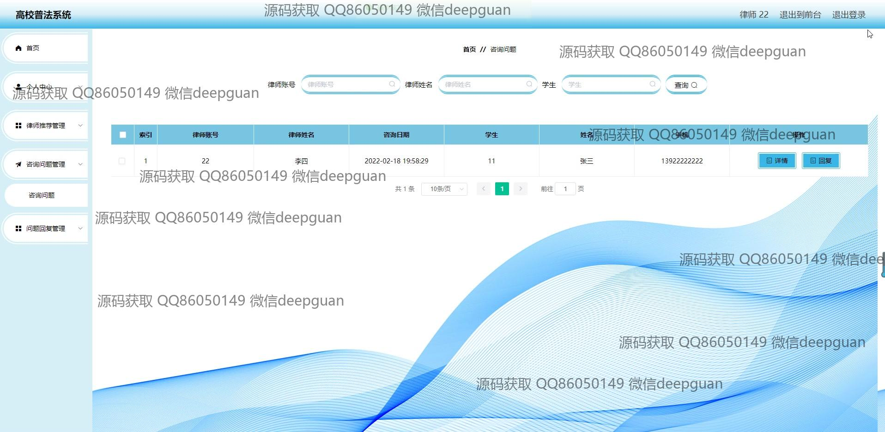

<h1 align="center">高校普法系统</h1>

## 简介
高校普法系统：提供用户及管理员功能，包括法律知识普及、在线咨询、新闻管理、个人信息管理、律师推荐等，支持法律资讯浏览、法律咨询和信息管理，界面简洁友好。    --计算机毕业设计源码；毕设源码；java毕业设计源码

## 联系方式

<h3 align="center">获取完整代码与数据库文件 + 微信：deepguan QQ: 86050149 QQ群: 783742310</h3>

<h3 align="center">可帮忙远程部署 包运行成功！提供远程部署、修改代码、设计文档指导、代码讲解等服务！</h3>

## 功能介绍（完整见运行截图）
管理员：基本功能包括登录、注册和退出。管理系统提供强大的后台功能模块，包括学生管理、律师管理、新闻管理、法律知识管理、类型管理、咨询问题管理等，便于管理员在各个子模块中高效地分配和管理用户信息，以及发布和管理法律资讯。管理员可以使用文本编辑器来变更系统内容，支持多种内容格式的编辑和维护。通过律师库管理和新闻发布，管理员能有效地提高普法教育的效率。

用户：基本功能包括登录、注册和退出，高校普法系统为用户提供了法律知识普及、法律新闻、律师推荐、普法论坛、法律与校园等服务，带来丰富的法律相关内容。用户可以通过首页导航快捷地访问不同模块，获取最新法律信息、参与知识测试、提交咨询问题并查看法律案例的解析。个人中心提供对个人信息的管理和法律资讯查询，提升用户的法律素养和知识水平，使用户能够更好地理解和运用法律知识。

## 运行截图

本代码来源于网络,仅供学习参考使用!

